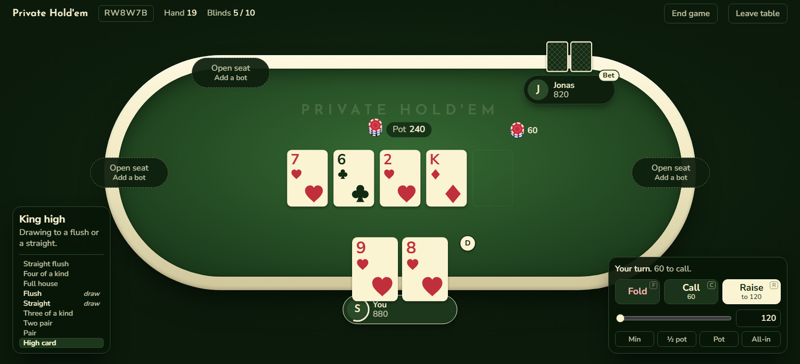
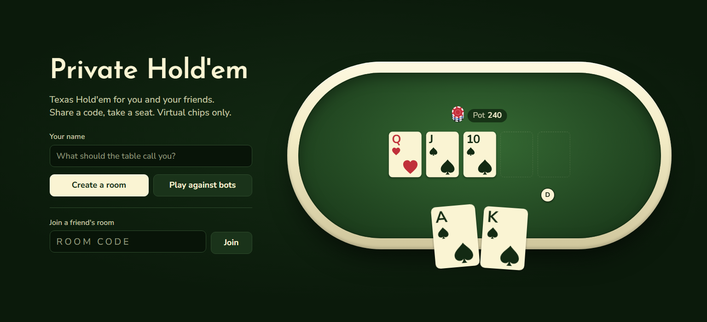
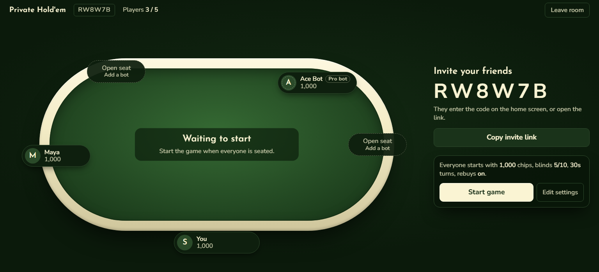
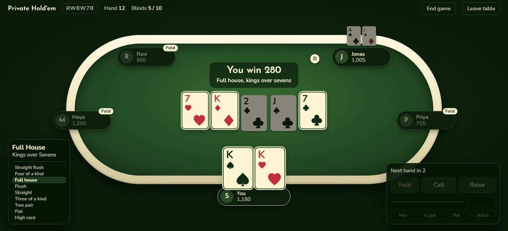
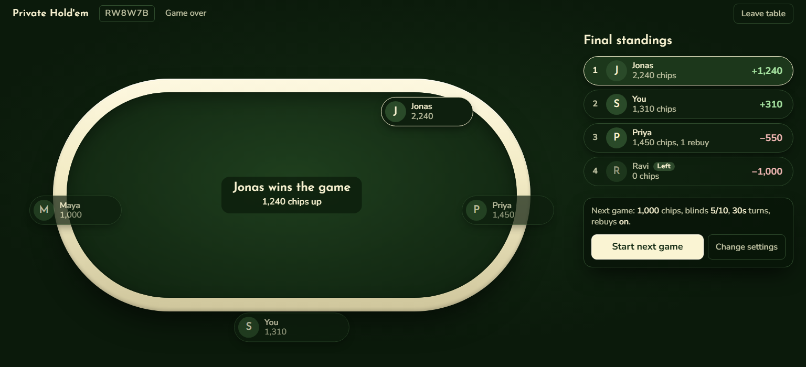
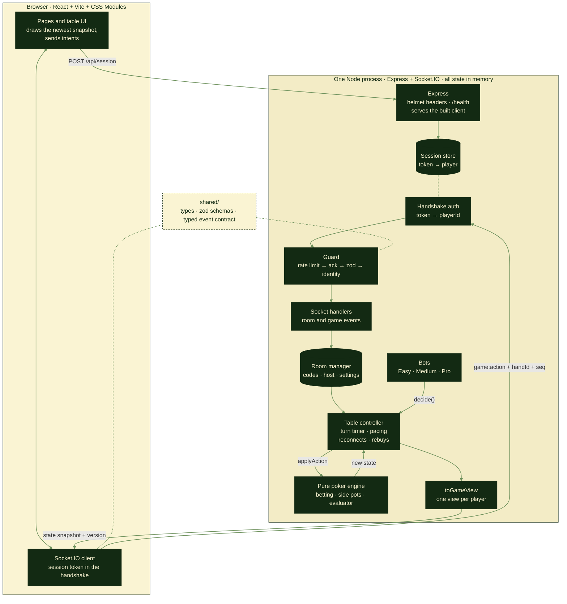
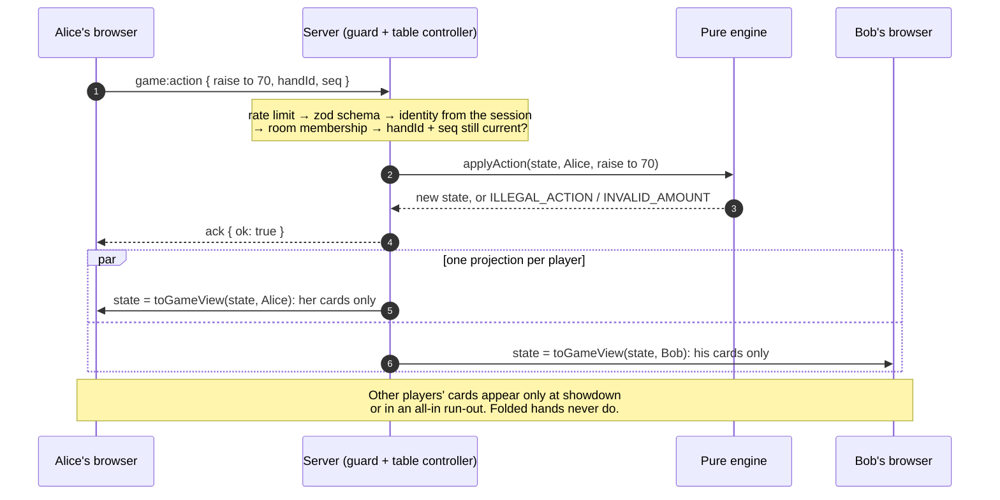

# Private Hold'em

Private multiplayer Texas Hold'em for 2–5 friends. Virtual chips only.

Create a room, share the six-character code, and play in the browser. Empty seats can be filled with bots (Easy, Medium or Pro), or you can play a solo game against bots. The server deals every card and settles every pot; the browser only shows what the server sends it.



<table>
  <tr>
    <td width="50%"></td>
    <td width="50%"></td>
  </tr>
  <tr>
    <td align="center"><b>Home</b>: create a room, play against bots, or join with a code</td>
    <td align="center"><b>Lobby</b>: share the code, add bots, start when everyone is seated</td>
  </tr>
  <tr>
    <td width="50%"></td>
    <td width="50%"></td>
  </tr>
  <tr>
    <td align="center"><b>Showdown</b>: the winning hand is named and its five cards are lit</td>
    <td align="center"><b>Game over</b>: final standings, then start the next game</td>
  </tr>
</table>

- Product: [docs/product-spec.md](docs/product-spec.md)
- Poker rules: [docs/game-rules.md](docs/game-rules.md)
- Architecture: [docs/architecture.md](docs/architecture.md)
- Build phases: [docs/build-plan.md](docs/build-plan.md)

## Architecture

One Node process serves the React app, the session API and the Socket.IO connection from one address. The server holds every room and game in memory and is the only side that decides anything: cards, turns, legal actions, bet sizes, pots and winners. The browser sends intents and draws the snapshots it gets back.



**Life of one action.** Alice raises; every player gets a fresh snapshot built for them alone.



Key rules (full detail in [docs/architecture.md](docs/architecture.md)):
- **Identity** comes only from the session token in the Socket.IO handshake, never from a payload field or `socket.id`.
- **Every outbound state** goes through `toGameView()` in `server/src/engine/view.ts`.
- **The engine is pure:** no timers, no I/O, no `Math.random`. The deck is shuffled with Fisher–Yates over `crypto.randomInt` and injected, so tests can use fixed decks.
- **Stale actions are refused:** each action carries the `handId` and `seq` of the snapshot it was based on, so double clicks and delayed packets get `STALE_ACTION`.
- **One instance only:** games live in memory, so a restart or deploy ends them (see [docs/deployment.md](docs/deployment.md)).

## Requirements
Node.js 22.12+ and npm 10+.

## Getting started
```bash
npm install
cp .env.example .env   # optional; defaults work
npm run dev
```
Open http://localhost:5173. The Vite dev server proxies `/api`, `/health` and `/socket.io` to the Node server on `API_PORT` (3000).

`PORT` always means "the port you open in the browser": Vite's port in development, the Node server's port in production. See `.env.example`.

### Looking at the table without a game (development only)
Browser tests: `npm run e2e` builds the app and plays real games in Chromium (three players, and a solo game against bots). The first run needs `npx playwright install chromium`.

`http://localhost:5173/dev/table?state=turn` renders the real table from sample data. Other states: `flop` (side pot, all-in, away and left seats), `showdown`, `waiting`, `busted` (rebuy prompt), `busted-off`, `ending` (host ended the game), `finished` and `finished-guest` (the game-over screen; add `&edit=1` for the settings editor), `bots` (two bots at the table, open seats for more), `bots-waiting` (only bots have chips, so the table waits), `bots-finished`, `draw` / `board` (the hand hint with two draws, and with a hand the board makes), and `lobby`, `lobby-guest` and `lobby-alone` (before the first hand; `&edit=1` opens the settings editor). The other screens are at `?screen=create`, `invite`, `joining`, `problem` and `toast` (a toast with the reconnecting banner). The approved design prototype is `client/prototypes/table-prototype.html`.

### Testing several players in one browser (development only)
All tabs normally share one identity (a second tab takes over the first). To play as different people in one browser, add `?player=<id>` to a tab's URL once, e.g. `http://localhost:5173/?player=2`. That tab keeps its own separate guest session until it is closed. A small "dev player 2" tag shows which one you are.

## Scripts
| Command | What it does |
|---|---|
| `npm run dev` | Server (tsx watch) + client (Vite) together |
| `npm test` | Vitest in every workspace |
| `npm run typecheck` | `tsc` in every workspace |
| `npm run lint` | ESLint over the repo, including engine-purity rules |
| `npm run build` | Bundle the server (tsup) and build the client (Vite) |
| `npm start` | Run the production build: one server on `PORT` serving the client, API and Socket.IO |
| `npm run check` | typecheck + lint + test + build |
| `npm run e2e` | Build, start the production server on port 4173, and play real games in Chromium (Playwright) |

**Deploying:** one Render web service from `render.yaml`. See [docs/deployment.md](docs/deployment.md) for the steps, the environment variables and the one-instance rule (games live in memory, so a deploy ends them).

The poker engine's property test plays 1,500 random hands on every run, and the table simulation plays 150 random games (joins, leaves, disconnects, timeouts). For a longer soak:
```bash
npx cross-env ENGINE_PROPERTY_RUNS=50000 TABLE_SIMULATION_RUNS=3000 npm test -w @poker/server
```

## Layout
```
shared/   types, constants, zod schemas, Socket.IO event contract (TypeScript source, no build step)
server/   Express + Socket.IO; the pure poker engine lives in server/src/engine
client/   React + Vite + CSS Modules
docs/     specs; README screenshots in docs/screenshots
e2e/      Playwright end-to-end tests
```

The README screenshots are the real table rendered from sample data at a 1536×700 laptop window (`/dev/table?state=draw`, `lobby`, `showdown`, `finished`, and the home page).
